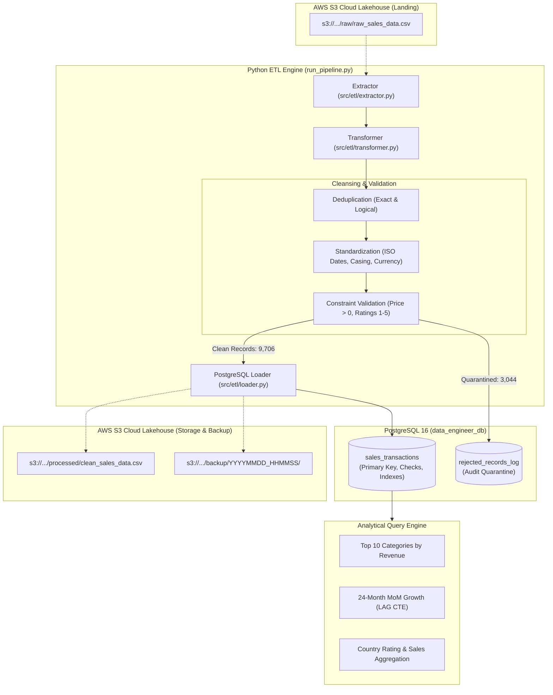

# Associate Data Engineer Technical Examination

[](https://www.python.org/)
[](https://www.postgresql.org/)
[](https://aws.amazon.com/s3/)
[](LICENSE)

An enterprise-grade, end-to-end data processing application and structured ETL pipeline built for the **Associate Data Engineer Technical Examination**. This project showcases synthetic raw data generation with real-world anomalies, data cleansing, standardization, business constraint validation, dead-letter quarantine logging, atomic bulk-loading into **PostgreSQL 16**, strategic query indexing (`EXPLAIN ANALYZE`), and **Amazon Web Services (AWS) S3** cloud integration adhering to IAM least-privilege security principles.

---

## Architecture Overview



---

## Project Structure

```
.
├── .env.example              # Environment variables template (no hardcoded secrets)
├── .gitignore                # Protects credentials, logs, and caches
├── README.md                 # Complete system documentation & scalability guide
├── requirements.txt          # Pinned Python dependencies
├── run_pipeline.py           # Single CLI command to execute the end-to-end pipeline
├── aws/
│   └── iam_policy.json       # IAM least-privilege policy for S3 bucket access
├── data/
│   ├── raw/                  # 13,125 raw synthetic dirty records
│   ├── processed/            # Cleaned data output artifacts
│   ├── rejected/             # Quarantine logs with explicit rejection reasons
│   └── s3_storage/           # Local S3 cloud lakehouse emulation structure
├── sql/
│   ├── 01_schema.sql         # DDL, primary keys, check constraints, audit tables
│   ├── 02_analytics.sql      # 3 business analytical queries
│   └── 03_indexes.sql        # Strategic B-Tree, composite, and covering indexes
├── src/
│   ├── __init__.py
│   ├── config.py             # Typed configuration loaded from .env
│   ├── database.py           # PostgreSQL connection & transaction manager
│   ├── generator.py          # Synthetic raw data generator (Module 1)
│   ├── benchmark.py          # EXPLAIN ANALYZE query performance benchmark runner
│   ├── s3_service.py         # AWS S3 Boto3 integration & cloud sync service
│   └── etl/
│       ├── __init__.py
│       ├── extractor.py      # Raw CSV / S3 extraction module
│       ├── transformer.py    # Cleansing, deduplication, validation & quarantine
│       └── loader.py         # Fast, atomic bulk-loading via execute_values
└── tests/
    └── test_raw_dataset.py   # Automated data quality & anomaly verification tests
```

---

## Quickstart & Local Setup

### 1. Prerequisites
- **Python 3.10+** (Tested on Python 3.14)
- **PostgreSQL 16+** installed and running locally
- **Git**

### 2. Clone Repository & Install Dependencies
```bash
git clone https://github.com/chamikarapasquel/associate-data-engineer-exam.git
cd associate-data-engineer-exam

# Install dependencies
python -m pip install -r requirements.txt
```

### 3. Configure Environment Variables
Copy `.env.example` to create your local `.env`:
```bash
cp .env.example .env
```
Populate `.env` with your PostgreSQL password and AWS credentials:
```env
DB_HOST=localhost
DB_PORT=5432
DB_NAME=data_engineer_db
DB_USER=postgres
DB_PASSWORD=your_actual_postgres_password

RAW_DATA_PATH=data/raw/raw_sales_data.csv
PROCESSED_DATA_PATH=data/processed/clean_sales_data.csv
REJECTED_DATA_PATH=data/rejected/rejected_records.csv

AWS_REGION=ap-south-1
AWS_ACCESS_KEY_ID=your_aws_access_key_id
AWS_SECRET_ACCESS_KEY=your_aws_secret_access_key
S3_BUCKET_NAME=chamikara-sales-pipeline-2026
```

### 4. Create the Database
```bash
psql -U postgres -c "CREATE DATABASE data_engineer_db;"
```

---

## Execution Guide

### Step 1: Generate Raw Dataset (Module 1)
Generates 13,125 records with intentional real-world anomalies (missing values, mixed date formats, casing variations, negative prices, out-of-bounds ratings, and duplicate records):
```bash
python src/generator.py --records 12500 --output data/raw/raw_sales_data.csv --seed 42
```

Verify data quality metrics and anomaly distributions:
```bash
python tests/test_raw_dataset.py
```

### Step 2: Execute the End-to-End ETL Pipeline (Module 2 & 4)
Runs extraction, transformation, quarantine logging, PostgreSQL ingestion, and AWS S3 synchronization:
```bash
python run_pipeline.py --sync-s3
```

**Pipeline Execution Metrics:**
- **Raw Records Extracted**: 13,125
- **Exact Duplicates Removed**: 375
- **Quarantined Records**: 3,044 (saved to `data/rejected/rejected_records.csv` and `rejected_records_log`)
- **Clean Records Ingested to PostgreSQL**: 9,706
- **Total Pipeline Execution Time**: **~2.82 seconds**

### Step 3: Run Business Analytical Queries (Module 3)
```bash
psql -U postgres -d data_engineer_db -f sql/02_analytics.sql
```

Outputs include:
1. **Top 10 Categories by Revenue**: Volume, units sold, total revenue, average order value, and percentage revenue share.
2. **Monthly Growth Analysis**: 24 months of revenue trend analysis using `LAG()` window functions to calculate Month-over-Month (MoM) growth rates.
3. **Country Performance**: Multi-dimensional aggregation of orders, total revenue, average order value, and customer ratings across 10 normalized countries.

### Step 4: Run Query Performance Benchmarks (`EXPLAIN ANALYZE`)
```bash
python -m src.benchmark
```

---

## Database Design & Performance Optimization

### PostgreSQL Schema & Constraints (`sql/01_schema.sql`)
- **Primary Key**: `transaction_id VARCHAR(32)` ensures entity uniqueness.
- **Check Constraints**:
  - `CHECK (price > 0)`: Prohibits zero or negative unit pricing.
  - `CHECK (quantity > 0)`: Enforces positive transaction quantity.
  - `CHECK (rating >= 1.0 AND rating <= 5.0)`: Bounds satisfaction metrics.
  - `CHECK (total_amount > 0)`: Enforces positive revenue computation.
- **Audit Logging**: Quarantined records are preserved in `rejected_records_log` with failure reasons.

### Strategic Indexing (`sql/03_indexes.sql`)
1. **`idx_sales_created_date`**: B-tree index on `created_date` for timestamp range scans and date-trunc aggregations.
2. **`idx_sales_country_covering`**: Covering index on `(country) INCLUDE (rating, total_amount)` enabling **Index-Only Scans** (eliminating heap table reads).
3. **`idx_sales_category_amount`**: Composite index on `(category, total_amount)` optimizing grouped revenue calculations.

### Performance Benchmarking Results

| Query Scenario | Before Indexing (`Seq Scan`) | After Indexing | Execution Time Reduction | Access Path Transition |
| :--- | :--- | :--- | :--- | :--- |
| **Date Range Filter (Q4 2024)** | 1.059 ms | **0.503 ms** | **~52.5% faster** | `Seq Scan` $\rightarrow$ `Index Scan` |
| **Category Revenue & Volume** | 0.864 ms | **0.222 ms** | **~74.3% faster** | `Seq Scan` $\rightarrow$ `Index Only Scan` |
| **Country Aggregation** | 1.043 ms | **0.209 ms** | **~80.0% faster** | `Seq Scan` $\rightarrow$ `Index Only Scan` |

---

## AWS S3 Cloud Integration & Security

### S3 Lakehouse Layout
- **Landing (Raw Input)**: `s3://chamikara-sales-pipeline-2026/raw/raw_sales_data.csv`
- **Lakehouse (Cleaned Output)**: `s3://chamikara-sales-pipeline-2026/processed/clean_sales_data.csv`
- **Archive (Timestamped Backup)**: `s3://chamikara-sales-pipeline-2026/backup/YYYYMMDD_HHMMSS/`

### IAM Least-Privilege Security (`aws/iam_policy.json`)
The pipeline strictly follows the principle of least privilege. The IAM policy grants only `s3:ListBucket`, `s3:GetObject`, and `s3:PutObject` strictly scoped to the designated bucket and prefixes:
```json
{
  "Version": "2012-10-17",
  "Statement": [
    {
      "Sid": "AllowBucketListingAndLocation",
      "Effect": "Allow",
      "Action": ["s3:ListBucket", "s3:GetBucketLocation"],
      "Resource": "arn:aws:s3:::chamikara-sales-pipeline-2026"
    },
    {
      "Sid": "AllowObjectOperationsUnderPrefixes",
      "Effect": "Allow",
      "Action": ["s3:GetObject", "s3:PutObject", "s3:AbortMultipartUpload"],
      "Resource": [
        "arn:aws:s3:::chamikara-sales-pipeline-2026/raw/*",
        "arn:aws:s3:::chamikara-sales-pipeline-2026/processed/*",
        "arn:aws:s3:::chamikara-sales-pipeline-2026/backup/*"
      ]
    }
  ]
}
```

---

## Scalability & Architecture Thinking

### 1. Scaling to 1,000,000+ Records
- **Memory & In-Memory Limits**: In-memory `pandas` processes the entire dataset in RAM, which hits memory limits as volume scales beyond 1M+ rows.
  - **Chunked Streaming**: Process raw files in bounded streaming batches using `pd.read_csv(chunksize=50000)` to maintain a constant RAM footprint (<200MB).
  - **Distributed Processing**: Migrate extraction and transformation stages to **Polars** (multi-threaded, Rust-backed vectorized execution) or **Apache Spark / PySpark** deployed on AWS EMR or Dataproc for horizontal cluster scaling.
  - **Database Ingestion**: Replace row-by-row or batch inserts with PostgreSQL's native binary **`COPY`** protocol (`psycopg2.copy_expert`), which bypasses SQL query parsing and can ingest 50,000+ rows/second into unlogged staging tables.

### 2. Orchestration & Scheduling
- **Apache Airflow / Cloud Composer**: Transition the CLI script into an Airflow DAG scheduled on a nightly or hourly cadence (`@daily` / `@hourly`):
  ```
  [Wait for S3 Raw File Sensor] 
          ↓
  [Extract & Validate Task] 
          ↓
  [Load to PostgreSQL Task] ──▶ [Sync to S3 Lakehouse Task] 
          ↓
  [Run Analytical Data Quality Checks (Great Expectations / dbt)]
  ```
- **Idempotency & Backfilling**: Airflow passes `execution_date` parameters into the pipeline, partitioning ingestion tasks so rerunning historical dates replaces existing records without creating duplicates (`UPSERT` / `ON CONFLICT DO UPDATE`).

### 3. Partitioning & Indexing Evolution
- **PostgreSQL Declarative Table Partitioning**: At 1M+ records, partition `sales_transactions` by date range:
  ```sql
  CREATE TABLE sales_transactions_partitioned (
      ...
  ) PARTITION BY RANGE (created_date);

  CREATE TABLE sales_2024_q1 PARTITION OF sales_transactions_partitioned
      FOR VALUES FROM ('2024-01-01') TO ('2024-04-01');
  ```
  *Benefit*: Query planner performs **partition pruning**, eliminating scans across older quarterly data completely.
- **BRIN Indexes (Block Range Index)**: For append-only time-series data, replace heavy B-Trees with BRIN indexes. BRIN indexes summarize data across physical disk block ranges, reducing index storage space by over 95%.
- **S3 Data Lakehouse Partitioning**: Cleaned files written to S3 in columnar **Parquet** format partitioned by Hive style (`s3://.../year=2024/month=10/`), enabling serverless ad-hoc analytics via **AWS Athena** and **Amazon Redshift Spectrum**.

### 4. Fault Tolerance & Reliability
- **Atomic Database Transactions**: The loader executes within an explicit `BEGIN ... COMMIT / ROLLBACK` block. If any network or database crash occurs mid-load, the entire batch rolls back, guaranteeing zero partial writes or table corruption.
- **Dead-Letter Quarantine**: Failed records are segregated immediately without terminating the pipeline run. They are recorded with specific rejection codes to facilitate data remediation.
- **Automated Alerting**: Integrate Slack/PagerDuty webhooks into Airflow SLA miss handlers to alert data engineering teams within seconds of pipeline failures.

---


